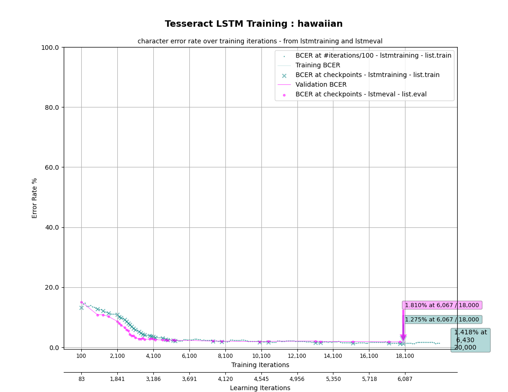
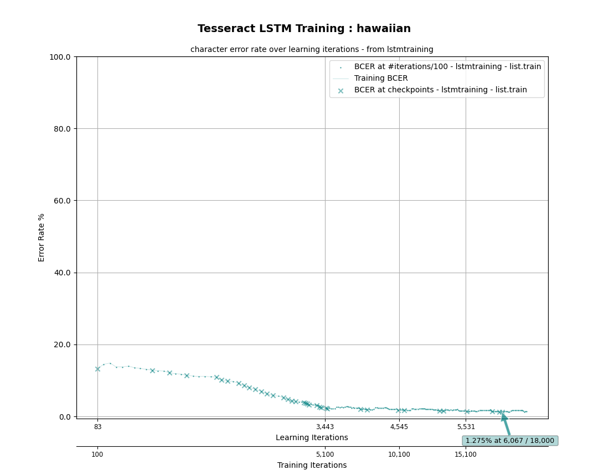
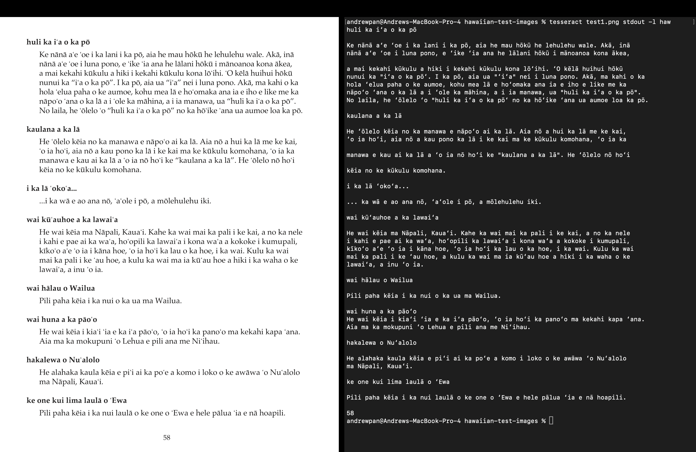
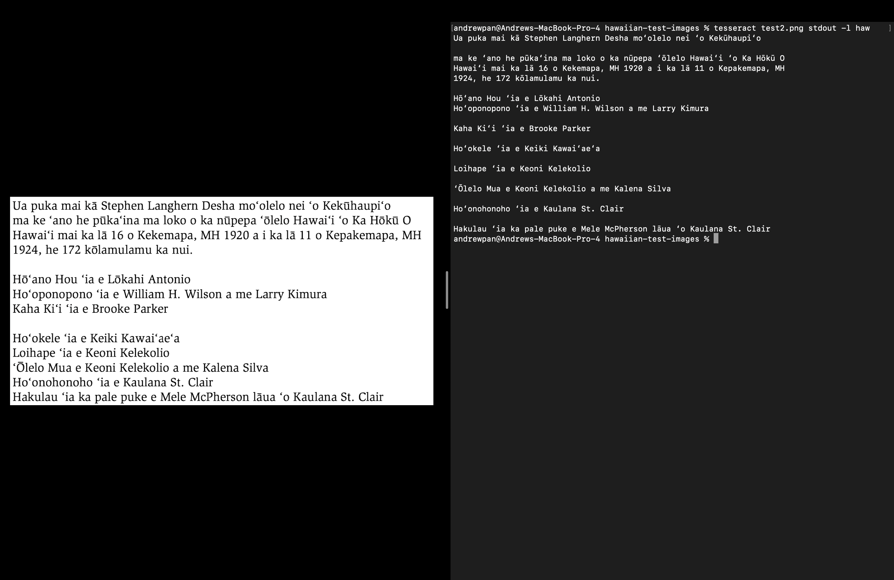
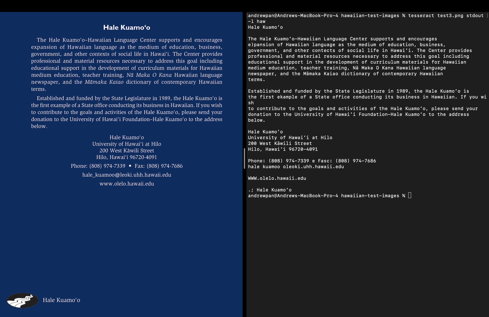
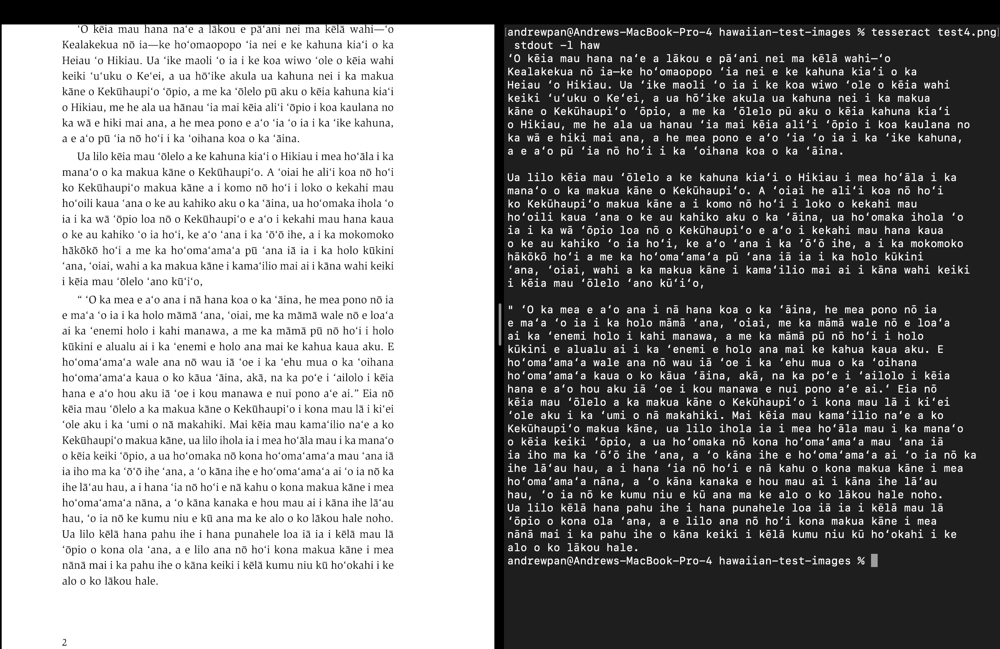

# tesseract-languages
ESB.AI Lab repo of released trained tesseract-ocr languages for language preservation

Welcome to our new Hawaiian Model! We trained this using [tesseract-ocr](https://github.com/tesseract-ocr/tesseract) on 2 books with 234 pages total - O Kamehameha (136 pages) and O Lunalilo (98 pages). This resulted in a BCER of 1.275% after 20K Iterations.

See below for how to replicate training our Hawaiian model with our labeled data, as well as the results below! 

## Hawaiian Language Notes
### Hawaiian Alphabet
The Hawaiian alphabet consists of 13 letters:
H, K, L, M, N, P, W, A, E, I, O, U, ʻ (ʻokina) and with vowels that can contain kahako's (ā, ē, ī, ō, ū).

Data scraping, data labeling and model training done by:
- [Edwin Solares, Ph.D. Lead PI](http://edwinsolares.com/)
- [Anthony Tong](https://github.com/atong28)
- [Welo Gosline-Niheu](https://github.com/weloniheu)
- [Andrew Pan](https://github.com/pandrew99)
- [Sadrac Santa-Cruz](https://github.com/SadracSantacruz)
- [Doanh Nguyen](https://github.com/doanhandonly)
- [Yashil Vora](https://github.com/yashilvora19)
- [Nikhil Rao, M.S.](https://github.com/nikhilitis)

We used [LabelStudio](https://labelstud.io/guide) community edition and [Docker](https://www.docker.com/) for assisting in data labeling and [Singularity CE](https://sylabs.io/docs/) and the [San Diego Super Computing Cluster](https://www.sdsc.edu/) for training.

---

# **📌 How to Train Tesseract OCR for Hawaiian**
### **🔹 1. Install Tesseract & Tesstrain**
First, install you should install **Tesseract** on your machine, using the installation guide [here](https://tesseract-ocr.github.io/tessdoc/Installation.html).

Verify the installation:
```sh
$ tesseract --version
```

Then, you should clone **Tesstrain**:
```sh
$ git clone https://github.com/tesseract-ocr/tesstrain.git
```
Then, navigate to `tesstrain` and make a `data` directory in it like  `tesstrain/data`, i.e.
```
$ cd tesstrain
$ mkdir -p data
```

We also need to download the existing trained languages:
``` 
$ git clone https://github.com/tesseract-ocr/langdata_lstm.git data/langdata
```
---

### **🔹 2. Prepare Training Files & Ground Truth Data**
Our training data located in the repo is `hawaiian-ground-truth`, which includes `.png` files and `.gt.txt` each having a line of Hawaiian text and its corresponding ground truth. To train, we need to move the ground truth data into the `tesstrain` directory, specifically in `tesstrain/data/hawaiian-ground-truth/`. 

If your current working directory is our repo you've cloned, you would move the directory `hawaiian-ground-truth` to `tesstrain/data/hawaiian-ground-truth/` making sure to modify the `tesstrain` path to wherever it is on your computer. For example:

```sh
$ cp -r hawaiian-ground-truth ./tesstrain/data/hawaiian-ground-truth/
```

Now we have our Hawaiian training data ready! 

---

### **🔹 3. Create Required Hawaiian Files**
Tesseract needs additional files in the `tesstrain` directory:

```sh
$ mkdir -p tesstrain/data/langdata/hawaiian 
$ mkdir -p tesstrain/data/mri
$ wget -P tesstrain/data/https://github.com/tesseract-ocr/tessdata_best/raw/main/mri.traineddata
```

Also, there is a `hawaiian` folder in this repo that contains the language details of Hawaiian that Tesseract needs to train, including the Hawaiian vocabulary, punctuation, and numbers. You should copy over the `hawaiian` directory from this repo to your `tesstrain/data/hawaiian` directory, i.e. 

```sh
$ cp -r hawaiian tesstrain/data/hawaiian
```

### **🔹 4. Train Tesseract on Hawaiian**

Now we can start training the Hawaiian language for Tesseract!

From `tesstrain`, you can start running the model by:
```sh
$ make training MODEL_NAME=hawaiian START_MODEL=mri PSM=6 TESSDATA=data MAX_ITERATIONS=20000
```

This might take around 20-30 minutes, depending on your computer. It automatically saves **checkpoints**.

If you need to stop:
```sh
$ CTRL + C
```
Resume later with:
```sh
$ lstmtraining \
  --continue_from data/hawaiian/checkpoints/hawaiian_checkpoint \
  --traineddata data/hawaiian/hawaiian.traineddata \
  --model_output data/hawaiian/checkpoints/hawaiian \
  --train_listfile data/hawaiian/list.train \
  --eval_listfile data/hawaiian/list.eval \
  --max_iterations 20000 \
  --target_error_rate 0.01
```

---

### **🔹 5. Finalize the Model**
Once training finishes:
```sh
$ lstmtraining \
  --stop_training \
  --continue_from data/hawaiian/checkpoints/hawaiian_best_checkpoint \
  --traineddata data/hawaiian/hawaiian.traineddata \
  --model_output data/hawaiian.traineddata
```

You can move the trained model to Tesseract, wherever your `tessdata` of all the languages are stored in `tesseract`:
```sh
$ sudo cp tesstrain/data/hawaiian.traineddata tessdata
```

Verify the model:
```sh
$ tesseract --list-langs
```
You should see `hawaiian` listed.

---

# Results & Graphs
We evaluated our Hawaiian Tesseract model performance based on the Between Character Error Rate (BCER) over the 20K training iterations ran, following the instructions [here](https://github.com/tesseract-ocr/tesstrain/blob/main/README.md#plotting-cer). We end up achieving a training BCER of 1.275%, and validation BCER of 1.810%! See the results below:




# **🔹 Test Your Own Hawaiian Images**
Now, you can run Tesseract OCR with Hawaiian on a test image:
```sh
$ tesseract test_image.png output -l hawaiian
$ cat output.txt
```

For example, see the following images from `hawaiian-test-images` and their Tesseract predictions in `hawaiian-images-results` as shown below!

### test1



### test2



### test3


### test4
